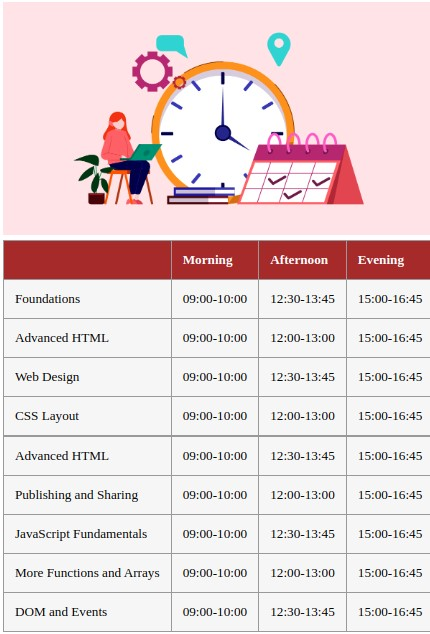

# Lecture Schedule
In this exercise, you will create a lecture schedule (time-table) similar to the picture shown. You will practice writing HTML tables.

## Instructions
1. You have been given a style sheet, `style.css`. Link this file to the html file to style the table you will create. Feel free to modify the CSS styles to suit your taste.
2. You have been given the `index.html` page. To start, it does not have much content. In the `index.html` file:
    - Insert the image `ttms.png`, so that it appears above the table.
    - Add a pair of opening and closing tags for the table element.
    - Type in a pair of tags for the `<thead>` element. Add table header data (Morning, Afternoon and Evening) appropriately into the `<thead>` element.
    - Add the opening and closing `<tbody>` tags, and insert the remainder of the table data between the <tbody> elements. Your aim is to generate exactly the table shown in the image above.
3. You have been given a text file, `data.txt`. It contains the data required for the table.