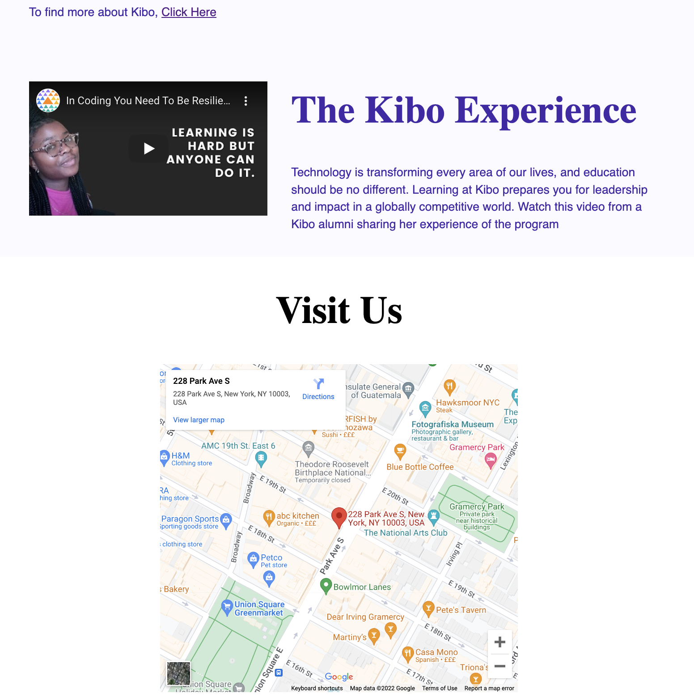

# Kibo mini website

This project is an extract from the [kibo website](https://www.kibo.school). Your task is to embed different multimedia contents in this website and use your knowledge of layout to arrange the elements appropriately.

After completing the instructions, your website should look like this:

## Starter Code
We've provided starter code which contains the content of the website and the default style. Included files are

- `index.html`: content of the website, including comments on where you should add your own code
- `style.css`: Colors and font styles for the page. You'll have to add the layout and positioning.

**Note: The colors and fonts are already styled. Focus on fixing the layout!**

## Instructions

Before starting, run the code to see the current state of the website. Read through `index.html` to see the initial contents.

### Part 1: Add multimedia content

First, you'll add the logo, videos, and map to `index.html` where the comments suggest.

1. Add the kibo logo using the provided `kibo-logo.svg` file in the images folder.
2. Embed this [youtube video](https://www.youtube.com/watch?v=RGjYCLen6os) in the first `<article>` section, such that it is right before "Reach your peak" text: `https://www.youtube.com/embed/RGjYCLen6os`
3. Embed [this youtube video](https://www.youtube.com/embed/wv6HAnysMYc) in the second `<article>` section just after the "The Kibo Experience" text: https://www.youtube.com/embed/wv6HAnysMYc
4. Embed a map in the `<section>` with text 'Visit Us' showing the address of Kibo: 228 Park Avenue South, New York, NY. ([Click here](https://www.google.com/maps/place/228+Park+Ave+S,+New+York,+NY+10003/@40.7377301,-73.9883773,17z/data=!3m1!4b1!4m5!3m4!1s0x89c259a189d93c29:0x300099f29cad7a9!8m2!3d40.7377301!4d-73.9883773) to open the address in Google Maps, then click 'Share -> Embed a map -> COPY HTML')

### Part 2: Styling (Optional - not graded)

1. Arrange the elements in the header using flexbox:
 - arrange the elements in a row
 - add space around the elements
 - align the elements along the center of the axis

2. Put the embedded videos and the text in the articles in flexboxes:
   - They should be centered along both vertical and horizontal axis.
   - The should wrap when the screen width is too small

3. In the "Visit Us" text to the center of the page, put the h2 and iframe into a flexbox:
   - It should be a column
   - It should center the text and map

### Wrapping up

Check that your version looks like the screenshots. Don't forget to submit your work!

### Remember

  1. If you get stuck, read the instructions again.
  2. Remember **G**o **C**limb **K**ibo - first **G**oogle, then ask the **C**ommunity on Discord, then reach out to **K**ibo instructional team.
  3. You can click ‘Submit’ in Replit to view a solution. Don’t forget to try the solution out in your own code, and submit the project again.